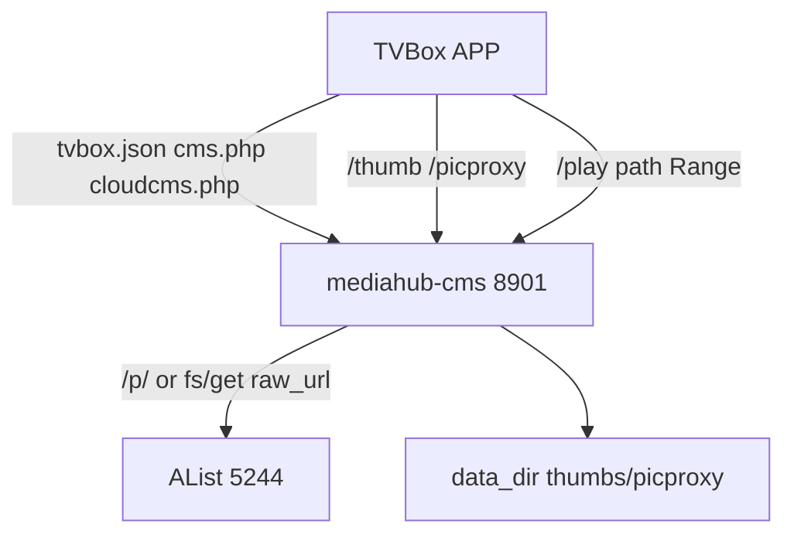

# 影视中心 APP 拉取与网盘播放

Feature Name: mediahub-app-play
Updated: 2026-10-09

## Description

加快 TVBox 类 APP 的订阅/列表/搜索/海报；全部网盘播放走 8901 `/play` 反代（Range）；把已截帧未登记和刮削失败的网盘影片补上封面。

## Architecture

APP 只打 8901。列表 JSON 用内存网盘缓存；海报优先本地 thumbs 与 picproxy 磁盘缓存；播放由 8901 跟随 AList 上游并透传 Range。

## Components and Interfaces

- `cloud_cms_response` / `search_cloud_resources`：播放地址改为 `http://{host}/play{path}?sign=`
- `CMSHandler._handle_play`：先试 `127.0.0.1:5244/p/`，403/失败则 `fs/get` 的 `raw_url` 流式转发
- `_send_json`：订阅和列表加短缓存头
- `/picproxy`：按 URL 哈希落盘，命中不再回源
- `_scrape_one`：已有 jpg 必须登记 `thumb://`；关键词为空仍截帧
- `_poster_fill_worker`：启动时回收已有 thumbs，缩短等待，并发补无封面条目
- `_grab_head_and_thumb`：优先对 AList 本地 `/p/` 做 ffmpeg seek

## Data Models

- 播放 URL：`http://<host>:8901/play/<alist-path>?sign=<optional>`
- Frame Poster 文件：`<data_dir>/cache/thumbs/<md5-16>.jpg`
- picproxy 缓存：`<data_dir>/cache/picproxy/<md5-16>`

## Correctness Properties

- 播放 URL 主机端口与订阅入口一致
- Range 请求得到 206 或带 Accept-Ranges 的 200
- 已存在且大于 2KB 的截帧文件会进入 `vod_pic`
- 安装新 APK 不删除 thumbs 与 poster_extra

## Error Handling

- `/p/` 403/超时：改走 raw_url；仍失败返回 502 JSON
- 截帧失败：写日志，下次批量刮削重试
- picproxy 回源超过 3 秒：返回空或旧缓存，不拖垮列表

## Test Strategy

- 本机 curl `/tvbox.json`、`/cloudcms.php/provide/vod`、带 Range 的 `/play/...`
- 对比刮削前后无封面条目数量
- 115 与夸克各播一条，确认起播与拖动

## References

[^1]: (Filename) - mediahub-cms.py 播放与截帧
[^2]: (Filename) - requirements.md
