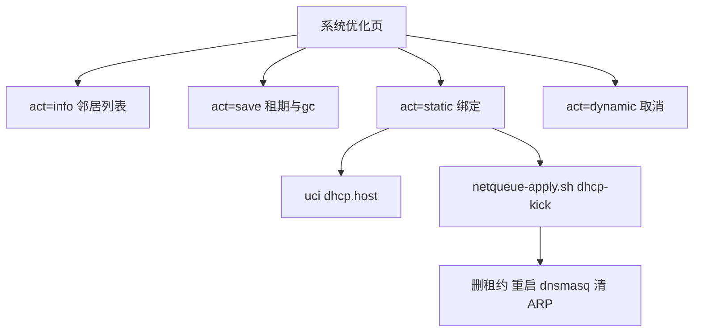

# DHCP 邻居与静态 IP

Feature Name: netqueue-dhcp-static
Updated: 2026-10-09

## Description

在 luci-app-netqueue 系统优化页增加 DHCP 邻居表、邻居 gc 秒数、静态 IP 绑定。绑定走独立 `?act=static|dynamic`，避免空保存误删 host。

## Architecture

## Components and Interfaces

- `netqueue.lua`: collect_clients、校验子网、写 host
- `index.htm`: 邻居表与绑定按钮
- `netqueue-apply.sh`: `gc_stale_time` 与 `dhcp-kick`

## Data Models

- `netqueue.main.neigh_gc`: 整数秒，默认 60，范围 5-86400
- `dhcp.host`: mac、ip、name
- info JSON `clients[]`: mac, ip, name, remain, static, sip, neigh

## Correctness Properties

- 主保存不改 host 列表
- 静态 IP 必须与 LAN 同网段且不是网关
- dhcp-kick 只处理已校验的 MAC/IP

## Error Handling

- 非法 MAC/IP、冲突 IP 返回 `ok:false` 与 message
- sysctl 对尚未创建的 br-lan neigh 项忽略失败

## Test Strategy

- 绑定已有租约 MAC 到新 IP 后，leases 无旧条目、uci host 存在
- 取消静态后 host 消失
- 过期租约不出现在 clients
