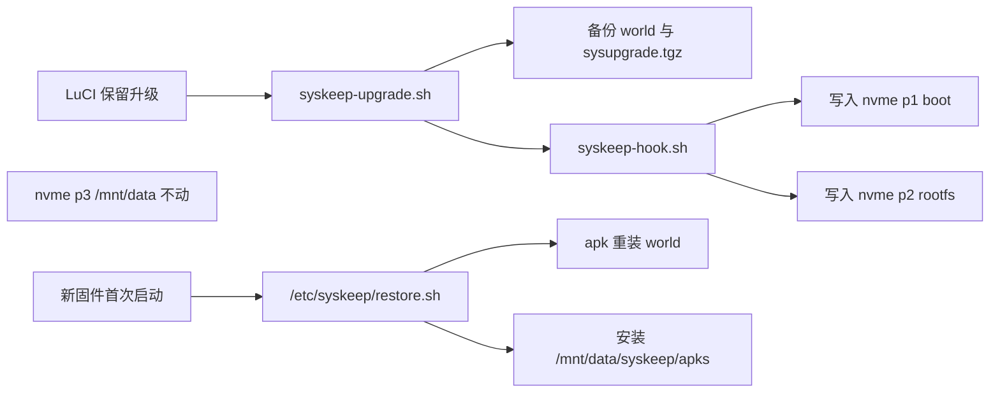

# 保留升级

Feature Name: firmware-keep-upgrade
Updated: 2026-10-09

## Description

在 ImmortalWrt x86 上刷 SNAPSHOT 时只写 boot 与 rootfs，保留 GPT 与 `/mnt/data`，并把 `/etc` 配置和 apk 插件清单带到新固件，开机后自动重装。

## Architecture

默认 `SAVE_PARTITIONS=1`。官方 combined 镜像分区表与当前盘不一致时，原版 `platform_do_upgrade` 会整盘 dd，会覆盖 data 分区。hook 改为只把镜像的 1、2 分区写到磁盘 1、2 分区。

## Components and Interfaces

- `syskeep-upgrade.sh`: `status|backup|download|test|flash`
- `/lib/upgrade/syskeep-hook.sh`: 覆盖 `platform_check_image` / `platform_do_upgrade`
- `/etc/syskeep/restore.sh`: 新固件开机重装插件（路径在 `/etc`，随 Keep Config 保留）
- `/etc/init.d/syskeep`: START=99 后台跑 restore
- LuCI `admin/system/syskeep`: 上传或 URL、校验、刷写、恢复进度

刷写命令：`sysupgrade -c -k <image>`，不传 `-p`。

## Data Models

`/mnt/data/syskeep/status.json`:

- `phase`: idle / backup / flash / restore / done / error
- `message`: 当前步骤
- `fail`: 重装失败的包名列表

`/etc/syskeep/world`: 刷机前的 `/etc/apk/world` 副本。

## Correctness Properties

- 镜像分区 1 或 2 的扇区数大于磁盘对应分区时，拒绝刷写
- `/mnt/data` 未挂载时，拒绝刷写
- 不写磁盘第 3 分区，不整盘 dd

## Error Handling

- 固件校验失败：中止，不刷写
- 单个 apk 安装失败：记入 `fail`，继续其余包
- 恢复脚本只在存在 `pending` 时运行一次；失败保留 pending 供手动重试

## Test Strategy

- `syskeep-upgrade.sh test` 走 `sysupgrade -T`
- 在路由器上确认 hook 已安装、数据盘检测、备份 tar 可生成
- 不在未确认时对生产盘执行 flash

## References

[^1]: `/lib/upgrade/platform.sh` on router - x86 combined 镜像在分区表不一致时整盘写入
[^2]: (Filename) - `.monkeycode/specs/firmware-keep-upgrade/requirements.md`
